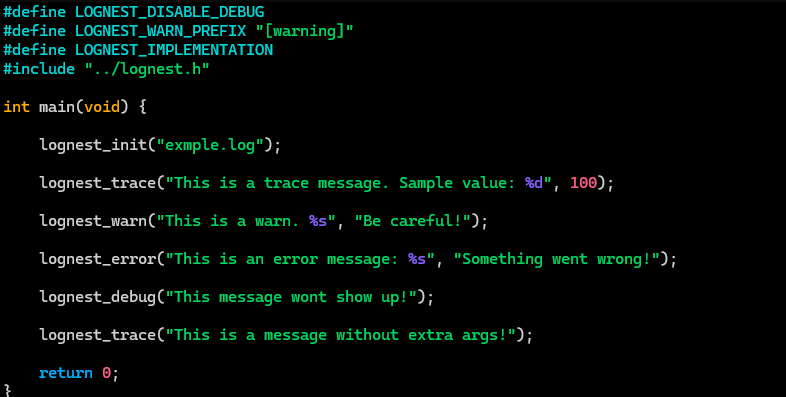

# LogNest

## A Simple yet customizable header only library for logging in C.


<sub>Image depicting the dafault configuration result</sub>

## Installing:

>[!NOTE]
> This is a macro heavy library, do of that what you will.

```
wget https://raw.githubusercontent.com/LeaoMartelo2/LogNest/main/lognest.h
```
<sub>just copy this if you are lazy</sub>

## Usage:

(Please refer to the examples if needed)

- Download `lognest.h` and add it to your project.
- `#define` the settings for your program ONLY in one file.
- Add `#define LOGNEST_IMPLEMENTATION` before including it ONLY in one file (the same you configured on).
- `#include` lognest.h normally and in any other file you need.

## Configuration:

- Disable any specific log level with:

```c
#define LOGNEST_DISABLE_<TRACE/WARN/ERROR/DEBUG>
```
<sub> Pairs great with -DLOGNEST_DISABLE_<LEVEL> on compile flags </sub>

- Change any log level identifier prefix with :
```c 
#define LOGNEST_<TRACE/WARN/ERROR/DEBUG>_PREFIX "<custom prefix>"
```
<sub> The separators (`[]`) around the type must also be included here. </sub>

- Disable either the date or time of the log with:
```c
#define LOGNEST_DISABLE_DATESTAMP
#define LOGNEST_DISABLE_TIMESTAMP
```



## Latest update changes:

### LogNest 3.1.0

- Reintroduced `LOGNEST_DISABLE_TIMESTAMP` and `LOGNEST_DISABLE_DATESTAMP`
